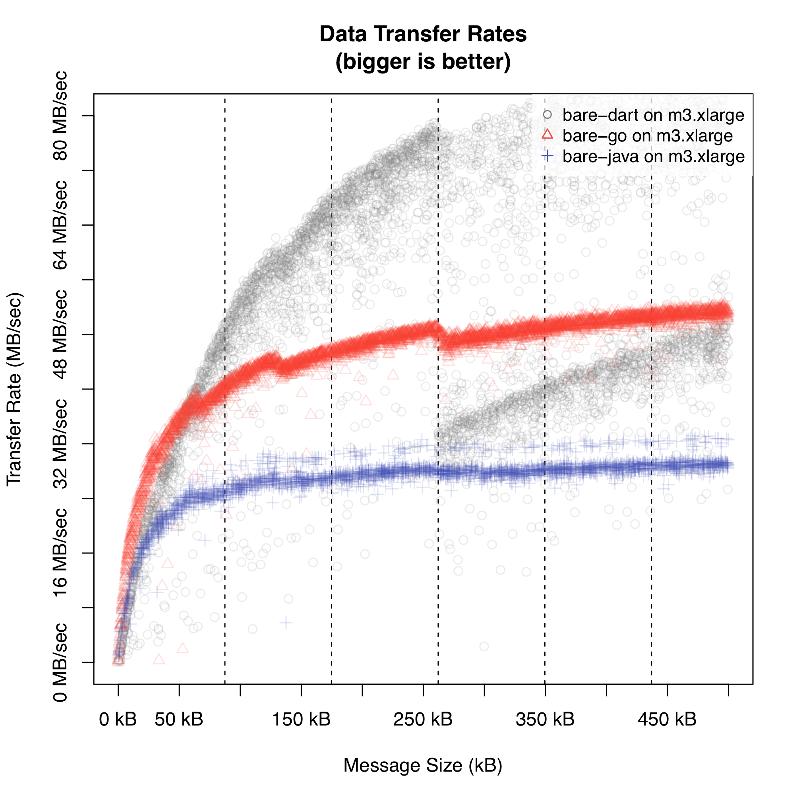

pingpong
========

A distributed HTTP-based and REST-like ping-pong system for test and benchmarking purposes.

If you are interested in some of the details there is a [research paper](https://www.researchgate.net/publication/292657431) about _ppbench_.

The intended usage of this package is to run two hosts which are queried (benchmarked) by a third host (the _siege_). 
Host 1 runs a _ping_ service querying a _pong_ service (on host 2) for the answer. 
_Ping_ and _pong_ build a very simple distributed system communicating via a simple HTTP based resource API.


From a benchmark host (this is called the _siege_ host) _ppbench_ is run againt host 1. 
_Ping_ host 1 has to interact with _pong_ host 2 to answer the request. 
The interaction between both hosts is very simple. 
Whenever host 1 (_ping_) is asked to deliver a document for '/ping/{n}' this request is passed forward to host 2 (_pong_). 
Host 2 (_pong_) returns the answer which is formed of a message "pooooong" where the message is as long in 
bytes as the number '{nr}' provided with the query. 

So we (or better _ppbench_) can vary the message size 
(and therefore the network load) between _ping_ (host 1) and _pong_ (host 2).

This setting shall be used to analyse the impact of infrastructures where _ping_ and _pong_ services are running on. 
The deployment above stays the same for every experiment. 
Just the underlying infrastructure of _ping_ and _pong_ changes. 

- _Ping_ and _Pong_ might be realized in different programming languages.
- _Ping_ and _Pong_ might be deployed on different virtual machine types.
- _Ping_ and _Pong_ might be deployed on different IaaS infrastructures.
- _Ping_ and _Pong_ might be deployed in a containerized form.
- _Ping_ and _Pong_ might be connected with an overlay network.
- and so on 

Therefore variations of benchmark results can be assigned to above mentioned changes in infrastructure.

## Set up a benchmark experiment

To do a benchmark you have to set up a _ping_ and a _pong_ host. 
This is highly automated and will install necessary dependencies. These include:

- Dart SDK
- Docker
- Docker overlay network Weave.
- Ruby runtime and development environment
- Golang SDK
- Java SDK
- ppbench (as benchmarking and analyzing front end)

It is possible to run the _Ping_ and _Pong_ service as a Docker container 
and as a Docker container connected to a Weave SDN network. Further container solutions and SDNs are planned for further releases.

If you are working with Ubuntu LTS 14.04 cloud machines 
(following user-data is not tested with other
distributions) capable to do cloud-config you can use the following
[user-data](cloud-init.txt) to simplify the setup of your machines a little bit: 

```
#cloud-config

packages:
  - git
  
runcmd:
  - [git, clone, "https://github.com/nkratzke/pingpong", /home/ubuntu/pingpong]
  - [chown, "-R", "ubuntu:ubuntu", /home/ubuntu/pingpong]
```

After booting simply run

```
./install.sh
```

in your /home/ubuntu directory to do all the installation. This works for the _pong_ as well as the _ping_ host.


### On the pong host: Set up the _pong service_

First step is to start the _pong_ service on the _pong_ host. This will start the _pong_ service on the host on port 8080.
You have three options to start the _pong_ service:

#### Run a bare pong service

```
pong:$ ./start.sh bare pong-{lang}
```

You want to check wether the _pong_ service is working correctly by checking that 

```
pong:$ curl http://localhost:8080/pong/5
```

answers with 'poong'.

#### Run a dockerized pong service

```
pong:$ ./start.sh docker pong-{lang}
```

This will build the ping pong image if necessary. So start up may take some time.
You can check whether the pong service is running:

```
sudo docker ps
```

You want to check wether the _pong_ service is working correctly by checking that 

```
pong:$ curl http://localhost:8080/pong/5
```

answers with 'poong'.

Please figure out the IP adress or DNS name of your pong host. We will refer to it as <code>&lt;ponghostip&gt;</code>. 

#### Run a dockerized pong service connected to a weave network

```
pong:$ ./start.sh weave pong-{lang}
```

This will build the ping pong image as well as the necessary weave containers if necessary. 
So start up may take some time (longer than docker start up above).
You can check whether the pong service is running:

You can check whether this container was successfully added to the weave network.

```
sudo weave status dns
```

should return something like that

```
pong         10.2.1.1        3efca64dc4aa 86:32:95:f5:e5:00
```

You want to check wether the _pong_ service is working correctly by checking that 

```
pong:$ curl http://localhost:8080/pong/5
```

answers with 'poong'.

Please figure out the IP adress or DNS name of your pong host. We will refer to it as <code>&lt;ponghostip&gt;</code>.

### On the ping host: Set up the _ping service_

Second step is to start the _ping_ service on the _ping_ host. This will start the _ping_ service on the host on port 8080.
You will have to provide the _ping_ service where it will find its _pong_ service by providing <code>&lt;pongip&gt;</code> 
what you have figured out for the _pong_ service above.

You have three options to do this:

#### Run a bare ping service

```
pong:$ ./start.sh bare ping-{lang} <ponghostip>
```

You want to check wether the _ping_ service is working correctly by checking that 

```
ping:$ curl http://localhost:8080/ping/5
```

answers with 'poong'.

#### Run a dockered ping service

```
pong:$ ./start.sh docker ping-{lang} <ponghostip>
```

This will build necessary images. So startup may take some time.

You want to check wether the _ping_ service is working correctly by checking that 

```
ping:$ curl http://localhost:8080/ping/5
```

answers with 'poong'.

#### Run a dockered ping service attached to weave network

```
pong:$ ./start.sh weave ping-{lang} <ponghostip>
```

This will build necessary images and will connect to the SDN network established by the pong host.
So startup may take some time.

You can check whether this container was successfully added to the weave network.

```
sudo weave status dns
```

should return something like that

```
ping         10.2.1.2        edb8527251a4 0e:37:c7:60:f2:d0
pong         10.2.1.1        2214f948aaa4 3e:07:d4:54:4e:d9
```

You want to check wether the _ping_ service is working correctly by checking that 

```
ping:$ curl http://localhost:8080/ping/5
```

answers with 'poong'.


### On the siege host: set up and run ppbench

We provide <code>ppbench</code> via RubyGems.org. So, installing <code>ppbench</code> 
on your siege system (we assume that this is your personal laptop or workstation) is very easy.
Assuming you have __Ruby 2.2 (or higher installed)__ installed, simply run

```
gem install ppbench
```

to install <code>ppbench</code>.

<code>ppbench</code> provides several commands and parameters to run and analyze your experiments.
<code>ppbench</code> comes with an online help included. Simply run

```
ppbench help
```

to get some online help about available commands <code>ppbench</code> is providing.

A benchmark run is started like that: 

```
ppbench run --host http://<pinghostip>:8080 \
            --experiment experiment_tag \
            --machine machine_tag \
            log.csv
```

A benchmark run can be defined via several parameters. To learn more, simply run:

```
ppbench help run
```

All benchmark results are written into a log (csv format). These csv based log files can be processed by <code>ppbench</code>. 
<code>Ppbench</code> is able to do some summary analysis on a set of collected benchmark files for a quick analysis. Simply run

```
ppbench summary *.csv
```

to get a result like this:

```
We have data for: 
+-------------+-----------+---------+-----------------+--------------+--------------+
| Experiment  | Machine   | Samples | Transfer (kB/s) | Requests/sec | Latency (ms) |
+-------------+-----------+---------+-----------------+--------------+--------------+
| bare-dart   | m3.xlarge |    4999 |        50752.03 |       298.51 |         3.35 |
+-------------+-----------+---------+-----------------+--------------+--------------+
| bare-go     | m3.xlarge |    4999 |        47329.98 |       194.53 |         5.14 |
+-------------+-----------+---------+-----------------+--------------+--------------+
| bare-java   | m3.xlarge |    2350 |        27749.37 |       111.94 |         8.93 |
+-------------+-----------+---------+-----------------+--------------+--------------+
| docker-dart | m3.xlarge |    4999 |        47892.43 |       276.13 |         3.62 |
+-------------+-----------+---------+-----------------+--------------+--------------+
| docker-go   | m3.xlarge |    4999 |        43761.69 |       183.17 |         5.46 |
+-------------+-----------+---------+-----------------+--------------+--------------+
| docker-java | m3.xlarge |    3535 |        28128.78 |       116.15 |         8.61 |
+-------------+-----------+---------+-----------------+--------------+--------------+
| weave-dart  | m3.xlarge |    4999 |        33645.47 |       189.50 |         5.28 |
+-------------+-----------+---------+-----------------+--------------+--------------+
| weave-go    | m3.xlarge |    9115 |        35385.75 |       152.34 |         6.56 |
+-------------+-----------+---------+-----------------+--------------+--------------+
| weave-java  | m3.xlarge |    4999 |        23586.90 |        92.07 |        10.86 |
+-------------+-----------+---------+-----------------+--------------+--------------+
```

But much more interesting and helpful (summary data is intended to be used for completenes and plausability checking of data but not for detailed analysis), 
<code>ppbench</code> is able to generate R scripts for analysis and visualization of benchmark data.

This command chain here (using Rscript and assuming you have the statistical framework R installed)

```
ppbench transfer-plot --machines m3.xlarge \
                      --experiments bare-dart,bare-go,bare-java \
                      --pdf graphic.pdf \
                      *.csv | Rscript -
```

would produce a R script which will generate a scatter plot of measured transfer rates on all benchmark runs that have been tagged to be run on m3.xlarge (AWS virtual machines) with the bare deployment of ping and pong services implemented in Dart, Go or Java programming languages. So the performance impact of several programming language to data transfer rates can be compared visually. A typical plot might look like this one here.


    
The plot commands of ppbench have several flags to tune your plotting. By using  the following additions flags
it is possible to plot 75% confidence bands without showing all measured detail data points (omitting the <code>--nopoints</code> would show both,
confidence bands and all data points).
    
```
ppbench transfer-plot --machines m3.xlarge \
                      --experiments bare-dart,bare-go,bare-java \
                      --withbands \
                      --confidence 75 \
                      --nopoints \
                      --pdf graphic.pdf \
                      *.csv | Rscript -
```

This would produce a much clearer picture with additional descriptive statistical information.


## Acknowledgement

Many thanks to our contributors.

- __René Peinl__ and his Systems Integration Research Group at Hof University (Institute for Information Systems) for providing the [Calico](http://www.projectcalico.org/) SDN integration.
