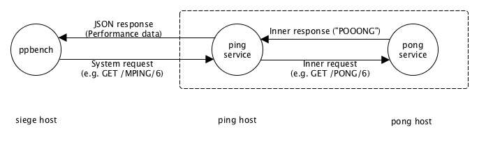

pingpong
========

A distributed HTTP-based and REST-like ping-pong system for test and benchmarking purposes.

The intended usage of this package is to run two hosts which are queried (benchmarked) by a third host (the _siege_). Host 1 runs a _ping_ service querying a _pong_ service (on host 2) for the answer. _Ping_ and _pong_ build a very simple distributed system.

From a benchmark host (this is called the _siege_ host) a benchmark (e.g. apachebench) is run againt host 1. _Ping_ host 1 has to interact with _pong_ host 2 to answer the request. The interaction between both hosts is very simple. Whenever host 1 (_ping_) is asked to deliver a document for '/ping/<nr>' this request is passed forward to host 2 (_pong_). Host 2 (_pong_) returns the answer which is formed of a message "pooooong" where the message is as long in bytes as the number '<nr>' provided with the query (so the answer message length can be specified by the _siege_ host to benchmark network performance of message sizes of varying length).

So the following answers would be generated for following requests by host 2:

- GET /pong/4 returns "pong"
- GET /pong/5 returns "poong"
- GET /pong/6 returns "pooong"
- and so on

So we can vary the message size (and therefore the network load) between _ping_ (host 1) and _pong_ (host 2).

This setting shall be used to analyse the impact of infrastructures where _ping_ and _pong_ services are running on. The deployment above stays the same for every experiment. Just the underlying infrastructure of _ping_ and _pong_ changes. Thererfore variations of benchmark results can be assigned to changing infrastructures.

For example you could be interested of the impact by several deployment strategies. IaaS cloud service providers normally provide options to deploy hosts into the same zone, into the same region or even into different regions. Normally network performance decreases from within zone to cross-zone and to cross-region. But how big is this impact?

To figure this out you can derive several experiments for example with Amazon Web Services EC2 service.

- Your reference data could be to deploy _ping_ and _pong_ into the same AWS availability zone (assumed to show best network performance).
- Your first experiment could be to deploy _ping_ and _pong_ into different availability zones to measure a cross-zone impact of deployments (assumed to show middle network performance, in fact you have neglible impacts according to our experience).
- Your second experiment could be to deploy _ping_ and _pong_ into different regions to measure a cross-region impact of deployments (assumed to show worst network performance).

In order to get fair results you should deploy _siege_ and _ping_ always into the same zone.
